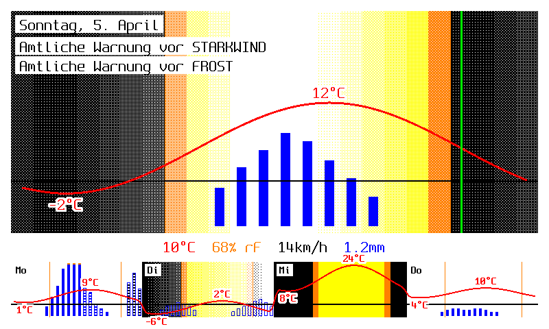

# homeschirm

Wetteranzeige für ein **Waveshare 7.3" 7-Farben E-Paper Display** (epd7in3f) auf einem Raspberry Pi.
Zeigt DWD MOSMIX-Forecast (5 Tage), aktuelle Messwerte und Wetterwarnungen an.



## Erklärungen:

- Stärke des Dithering ist die Bedeckung/Bewölkung. weiß = bewölkt, schwarz/orange/gelb = klar/sonnig
- blaue Balken sind der Niederschlag. Regen ist blau ausgefüllt, Schnee ist weiß ausgefüllt und Schneeregen, sowie Hagel sind ein gestrichelter Balken, wobei bei Hagel die Strichel schwarz sind.
- rote Linie ist die Temperatur, grüne Linie ist die aktuelle Uhrzeit (jetzt-Linie)

## eigene Wetterstation einstellen

in der config.js:

- ```observationEndpoint``` stellt die Wetterstation für die aktuellen Messwerte (POI) ein. (Text in mittlerer Zeile) 
- ```stationId``` stellt die MOSMIX-Station für die Graphen ein

Man kann die Stationen in den offiziellen DWD-Katalogen finden:
- MOSMIX-Stationskatalog (CFG): https://www.dwd.de/DE/leistungen/met_verfahren_mosmix/mosmix_stationskatalog.html
- POI-Beobachtungsstationen: https://opendata.dwd.de/weather/weather_reports/poi/

**Hinweis:** Nicht jede MOSMIX-Station hat POI-Beobachtungsdaten. Die beiden Einstellungen sind unabhängig voneinander – ggf. muss man eine nahegelegene POI-Station manuell suchen.


## Ablauf

1. DWD MOSMIX_S Forecast laden (KMZ, Station `P860` / 10865)
2. KML vorfiltern (nur relevante Station) und parsen
3. Aktuelle Messwerte von DWD POI abrufen
4. Wetterwarnungen laden (CAP/DISTRICT_CELLS)
5. PNG rendern via Node.js `canvas` (800×480px, 7 Farben)
6. PNG → BMP konvertieren (ImageMagick)
7. BMP ans Display senden (Python / Waveshare-Bibliothek)

## Voraussetzungen

- Raspberry Pi mit Waveshare 7.3" epd7in3f Display
- SPI aktiviert (`sudo raspi-config` → Interface Options → SPI)
- Node.js >= 21 (wird via nvm installiert)
- Python 3 mit PIL, numpy, spidev, gpiozero
- ImageMagick

## Daten

Alte Daten werden immer behalten und stündlich mit den neuen angereichert, damit auch die vergangenen Stunden
des heutigen Tages noch angezeigt werden können. Sie sind in der API-Antwort vom DWD nicht enthalten.

## Installation

```bash
git clone <repo-url> ~/homeschirm
cd ~/homeschirm
chmod +x configure.sh
./configure.sh
```

Das Setup-Script installiert alle Abhängigkeiten, richtet den systemd-Service ein und aktiviert den Autostart.

## Verwendung

### Auf dem Raspberry Pi (production)

```bash
# Service starten
sudo systemctl start homeschirm

# Service-Status prüfen
sudo systemctl status homeschirm

# Logs anzeigen
journalctl -u homeschirm -f

# Service stoppen
sudo systemctl stop homeschirm

# Autostart deaktivieren/aktivieren
sudo systemctl disable homeschirm
sudo systemctl enable homeschirm
```

Der Service startet automatisch bei Boot und aktualisiert das Display jede Stunde (Minute :46).

### Lokale Entwicklung

Daten holen oder dummy anlegen:

```bash
node src/scripts/createDummyData.js
```

oder

```bash
node src/scripts/createLiveData.js
```

Im Anschluss kann auf lokal oder auf dem Pi getestet werden:

#### auf lokalem Rechner

nur Bild erzeugen (data/screen.png)
```bash
node src/scripts/test.js
```

#### auf Raspberry Pi

Bild erzeugen und ans Display senden
```bash
node src/scripts/test_pi.js
```

#### Daten zurücksetzen

```bash
npm run reset
```

## Display & Farben

Das Display unterstützt exakt 7 Farben:

| Farbe | Hex | Verwendung |
|-------|-----|------------|
| Weiß | `#fff` | Hintergrund, Tag |
| Schwarz | `#000` | Nacht, Rahmen, Text |
| Rot | `#f00` | Temperaturkurve |
| Grün | `#0f0` | Jetzt-Linie |
| Blau | `#00f` | Niederschlag |
| Gelb | `#ff0` | Sonnenstunden |
| Orange | `#ff8000` | Dämmerung, Messwerte |

## Schrift

[Spleen](https://github.com/fcambus/spleen) – Bitmap-Font in drei Größen (6×12, 8×16, 12×24), optimiert für pixelgenaue Darstellung ohne Antialiasing.

## Datenquellen

- **Forecast:** [DWD MOSMIX_S](https://opendata.dwd.de/weather/local_forecasts/mos/MOSMIX_S/)
- **Messwerte:** [DWD POI](https://opendata.dwd.de/weather/weather_reports/poi/) (Station 10865)
- **Warnungen:** [DWD CAP Alerts](https://opendata.dwd.de/weather/alerts/cap/)

## AI Hinweis
Claude Code hat bei der Erstellung unterstützt, aber der Großteil des Projekts wurde menschlich erstellt.
